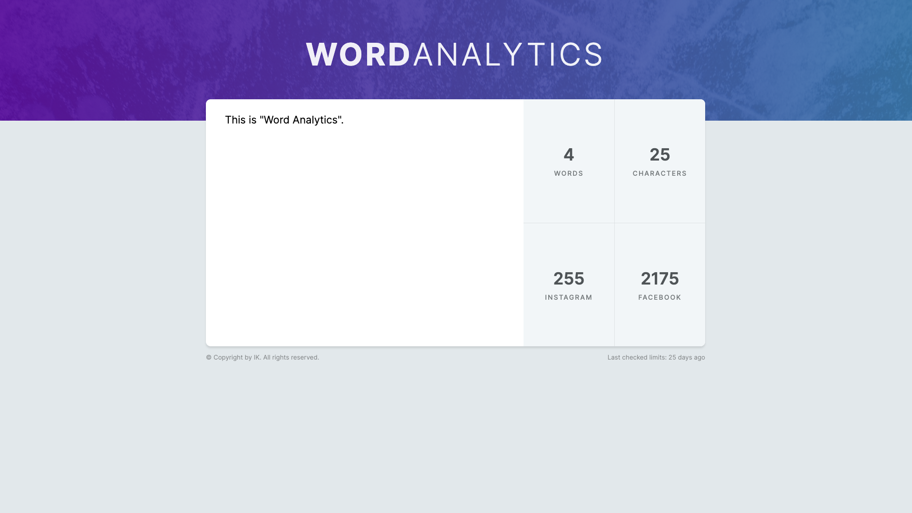

# Word Analytics App

## Sneak Peak



## Prerequisites

Before you begin, ensure you have the following installed on your machine:

- [Node.js](https://nodejs.org/) (v14.18.0 or higher)
- [Git](https://git-scm.com/)

## Steps to Download and Run the Project

### 1. Clone the Repository

First, clone the repository to your local machine using the following command.

```bash
git clone https://github.com/pyaythar-k/word-analytics.git
```

### 2. Navigate to the Project Directory

Change your current directory to the project directory.

```bash
cd your-folder-name
```

### 3. Install Dependencies

Install the project dependencies using npm or yarn. This command will read the package.json file and install all necessary packages.

```bash
npm install
```

or

```bash
yarn install
```

### 4. Run the Development Server

Start the development server using Vite. This will compile the project and start a local server.

```bash
npm run dev
```

or

```bash
yarn dev
```

## Enjoy.
